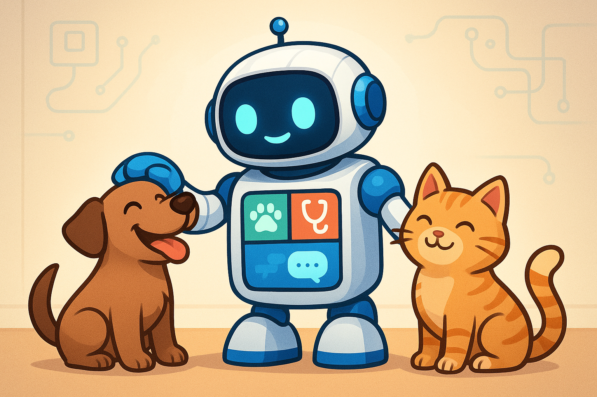
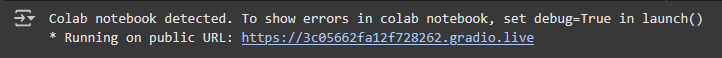
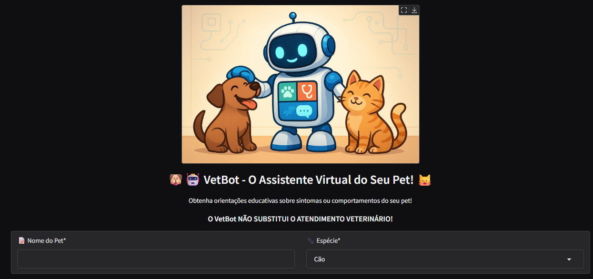
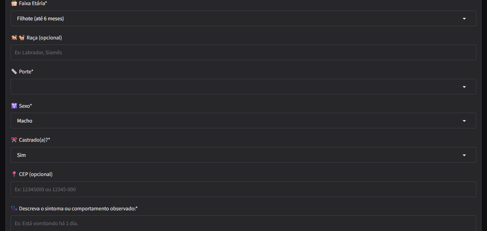
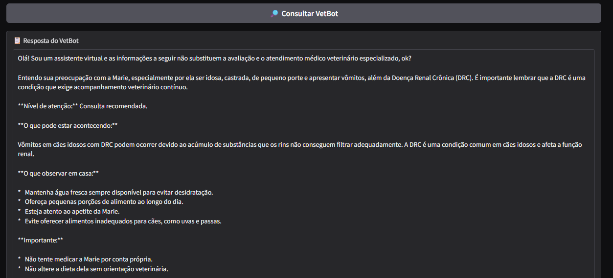

# 🐾 VetBot – O Assistente Virtual do Seu Pet 🐶🐱

**VetBot** é um assistente virtual impulsionado por inteligência artificial, projetado com carinho para ajudar tutores de cães e gatos a navegar pelas dúvidas do dia a dia sobre a saúde e o comportamento de seus companheiros de quatro patas. Ele oferece informações educativas claras e baseadas em conhecimento veterinário, dicas de cuidados gerais e orientações essenciais sobre quando é o momento certo de procurar um médico veterinário profissional.

Desenvolvido durante a **Imersão IA Alura e Gemini - 2025**, este projeto nasceu da paixão pela saúde animal e do desejo de tornar o acesso à informação mais fácil e rápido. O VetBot não substitui de forma alguma a consulta e o diagnóstico de um médico veterinário, mas atua como um **assistente de triagem inteligente, acessível e responsável**, fornecendo um primeiro nível de suporte e tranquilidade.

## ✨ O Que o VetBot Oferece?

Nosso objetivo é capacitar os tutores com conhecimento confiável para que se sintam mais seguros e capazes de identificar as necessidades de seus pets, promovendo uma rotina de cuidados mais consciente e proativa.

## 💡 Motivação Por Trás do Projeto

Como médica veterinária, frequentemente observei a ansiedade dos tutores diante de comportamentos que, embora normais, geravam grande preocupação (como o cio das gatas, por exemplo) e dificuldade em identificar a real urgência de alguns sintomas. O VetBot é a minha resposta a essa necessidade: uma ferramenta para **educar, tranquilizar e orientar** de forma acessível, reforçando sempre a insubstituível importância da consulta e do acompanhamento com um profissional médico veterinário qualificado.

## ⚙️ Funcionalidades Atuais

O VetBot foi construído com foco em fornecer informações relevantes e seguras:

*   📋 **Perfil Detalhado do Pet:** Coleta informações essenciais como Nome, Espécie (Cão/Gato), Faixa Etária (Filhote, Jovem, Adulto, Idoso), Raça, Porte e Sexo para contextualizar as respostas.
*   🤒 **Análise de Sintomas e Comportamentos:** O tutor descreve a preocupação, e o VetBot busca informações relevantes de forma inteligente.
*   📘 **Explicações Educativas Embasadas:** Fornece informações sobre o sintoma ou comportamento com linguagem simples, baseada em conhecimento veterinário.
*   🚦 **Classificação do Nível de Atenção:** Ajuda o tutor a entender a possível urgência, classificando a situação em categorias como:
    *   🚨 **Emergência:** Requer atenção veterinária imediata.
    *   🏥 **Consulta Recomendada:** Sugere agendar uma visita ao veterinário em breve.
    *   📈 **Monitoramento:** Indica que a situação pode ser observada em casa com atenção.
    *   👍 **Comportamento Comum:** Esclarece que o comportamento pode ser normal para a espécie/idade.
*   🗺️ **Sugestão de Locais Veterinários Próximos:** Com base no CEP informado pelo tutor, o VetBot pode sugerir hospitais ou clínicas veterinárias na região. **(Nota: Sempre acompanhado de disclaimer sobre a necessidade de verificar diretamente com o local)**
*   🤖 **Conversa Natural:** Utiliza IA generativa (Gemini) para interagir de forma fluída e compreensível.
*   🔐 **Reforço Ético Contínuo:** Em todas as interações, o agente reforça explicitamente que não substitui o diagnóstico, a consulta ou o tratamento prescrito por um médico veterinário.

## 🧠 Como Funciona? (Arquitetura de Agentes)

O VetBot é estruturado em uma sequência lógica de agentes especializados para processar a informação de forma eficaz:

1.  **VetBot Buscador:** Recebe os detalhes do pet e o sintoma/dúvida. Utiliza a ferramenta de busca (Google Search) para encontrar informações relevantes sobre o sintoma e locais veterinários próximos.
2.  **VetBot Filtrador:** Analisa os resultados brutos da busca, filtra as informações mais confiáveis e com base científica sobre o sintoma, contextualizando-as para o perfil do pet.
3.  **VetBot Revisor:** Recebe as informações filtradas sobre o sintoma e a lista de locais. Revisa o texto final para o tutor, garantindo que seja claro, seguro, personalizado (usando o nome do pet), inclua as ressalvas éticas essenciais, a classificação de urgência e as sugestões de locais (com o disclaimer necessário).

## 🛠️ Tecnologias Utilizadas

*   **Google Gemini API:** O coração da IA generativa e da inteligência dos agentes.
*   **Google ADK (Agent Development Kit):** Framework para a construção e orquestração dos múltiplos agentes.
*   **Google Colab:** Ambiente de desenvolvimento e execução do projeto.
*   **Google Search Tool (ADK):** Ferramenta para buscas web gerais.
*   **Desenvolvimento de Custom Tool (ADK):** Implementação da integração com a Places API como uma ferramenta personalizada.
*   **Python:** Linguagem de programação utilizada.
*   **GitHub:** Para versionamento de código e documentação do projeto.

## 🚀 Instalação e Configuração

Para rodar o VetBot localmente no Google Colab, você precisará:

1.  **Clonar este repositório:** `git clone https://github.com/makanadani/vetbot.git`
2.  **Abrir o notebook principal (.ipynb) no Google Colab.**
3.  **Obter Chaves de API:**
    *   Uma chave da **Google AI Studio (para Gemini API)**.
4.  **Configurar Segredos no Colab:** Utilize a ferramenta de Segredos do Google Colab (ícone de chave 🔑 na barra lateral) para armazenar suas chaves de API de forma segura. Crie segredos com os nomes exatos:
    *   `GOOGLE_API_KEY` (para a API do Gemini)
5.  **Executar as células do notebook sequencialmente.** Isso instalará as bibliotecas necessárias e iniciará o fluxo de interação.

## ▶️ Como Usar

Após configurar e executar o notebook no Google Colab:

1.  O VetBot iniciará no terminal do Colab, com auxílio o Gradio, que gerará um link para acesso em outra aba.
2.  
3.  Siga as instruções, fornecendo os detalhes solicitados sobre o seu pet (Nome, Espécie, Idade, etc.) e descreva o sintoma ou comportamento que te preocupa.
4.  O VetBot processará as informações através de seus agentes.
5.  Aguarde a resposta final, que incluirá informações educativas sobre o sintoma, a possível classificação de urgência e, se o CEP foi informado, sugestões de locais veterinários próximos.

## 🖥️ Imagens da Interface

 
## 🌱 Próximos Passos e Evolução

O VetBot é um projeto em constante aprimoramento. Algumas possibilidades futuras incluem:

*   **Expansão de Espécies:** Incluir suporte e base de conhecimento para outros tipos de pets (aves, roedores, etc.).
*   **Personalização Avançada:** Incorporar dados como histórico de saúde, condições pré-existentes e medicações para respostas ainda mais contextualizadas.
*   **Melhoria na Busca de Locais:** Implementar busca por geolocalização (latitude/longitude) via Google Places API para maior precisão.
*   **Entrada Multimodal:** Explorar a possibilidade de receber e analisar imagens ou vídeos (ex: de uma lesão na pele, um movimento atípico) utilizando as capacidades multimodais do Gemini.
*   **Interface Amigável:** Desenvolver uma interface web ou integração com plataformas de mensagem para facilitar o acesso dos tutores.
*   **Base de Conhecimento Interna:** Complementar a busca online com uma base de dados interna de informações veterinárias curadas.

## 🙌 Agradecimentos

Este projeto foi carinhosamente desenvolvido como parte da **Imersão IA Alura e Gemini - 2025**. Agradeço à Alura pela excelente didática e estrutura da imersão, ao Google e à equipe do Gemini por disponibilizarem a tecnologia e aos instrutores pelo conhecimento compartilhado que tornou este projeto possível.
